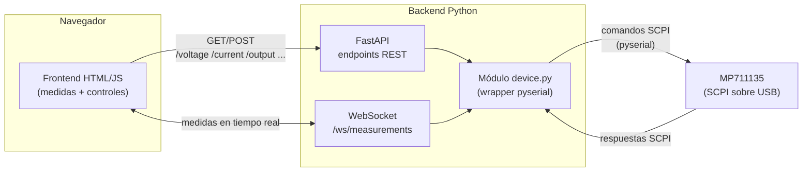

# MP711135 Tool

Interfaz web para controlar y monitorizar en remoto la fuente de alimentación DC **MP711135** (Multicomp Pro) desde el navegador, en vez de operarla desde sus controles físicos. El backend habla con el dispositivo por **USB usando comandos SCPI** a través de un puerto serie (**pyserial**), y expone esa funcionalidad a un frontend mediante una API construida con **FastAPI**.

## Qué hace la aplicación

- **Monitorización en tiempo real** de la salida: voltaje, corriente y potencia medidos, con gráfica de su evolución en el tiempo.
- **Control de la salida**: fijar tensión y límite de corriente, y encender/apagar la salida.
- **Configuración de protecciones**: ajustar los umbrales de OVP (sobretensión) y OCP (sobrecorriente).
- **Detección y aviso de fallos**: sobretensión, sobrecorriente o sobretemperatura, con indicación visual clara y opción de restablecer.
- **Indicación del modo de regulación** activo (CV - tensión constante / CC - corriente constante).

En resumen: la app sustituye el panel físico del MP711135 por un panel web, pensado para poder ajustar y vigilar la fuente desde el PC mientras se trabaja en el banco.

## El dispositivo

El MP711135 es una fuente de alimentación DC de banco de un solo canal, con multímetro (DMM) integrado.

- **Salida:** 0-60V / 0-10A, 300W
- **Resolución:** 10mV / 1mA (ajuste y lectura)
- **Protecciones:** OVP 0-61V, OCP 0-10.1A, OTP 85°C
- **Comunicación:** USB, compatible con SCPI
- **Pantalla:** LCD color 2.8" (240×320)
- **DMM integrado:** voltaje/corriente AC y DC, resistencia, capacitancia, continuidad y test de diodo

> ⚠️ El manual de programación SCPI disponible solo documenta comandos de la **fuente de alimentación**, no del DMM. El modo multímetro de la interfaz depende de conseguir esa documentación adicional; hasta entonces queda fuera del alcance real de control.
>
> **Probado contra hardware real:** asumiendo que el DMM respondiera a comandos SCPI genéricos estilo 34401A (`MEASure:VOLTage:DC?`, `MEASure:CURRent:DC?`, `MEASure:ALL?`, `FUNCtion?`, `CONFigure?`, además de AC/resistencia/capacitancia/continuidad/diodo), se probaron por el mismo puerto serie con la fuente encendida a un voltaje conocido (3.3V, sin carga). Los comandos DC no dieron error, pero sus lecturas **coincidieron exactamente con la medida de la fuente** (no con las puntas físicas del DMM), y el resto (AC, resistencia, capacitancia, continuidad, diodo) devolvió `ERR`. Conclusión: el firmware no expone el DMM integrado por SCPI con este set de comandos — solo redirige al canal de medida de la fuente. Sin documentación SCPI específica del DMM, el modo multímetro no es controlable remotamente; probablemente solo funciona desde el panel físico.

### Comandos SCPI disponibles (fuente de alimentación)

**Medición**
- `MEASure:VOLTage?` / `MEASure:CURRent?` / `MEASure:POWer?`
- `MEASure:ALL?` — voltaje, corriente y potencia en una sola consulta
- `MEASure:ALL:INFO?` — además incluye estado de fallos (OVP/OCP/OTP) y modo de operación (standby/CV/CC/fault)

**Configuración de salida**
- `OUTPut {ON|OFF}` / `OUTPut?`
- `CURRent <value>` / `CURRent?`
- `CURRent:LIMit <value>` / `CURRent:LIMit?` (OCP)
- `VOLTage <value>` / `VOLTage?`
- `VOLTage:LIMit <value>` / `VOLTage:LIMit?` (OVP)

**Sistema**
- `SYSTem:LOCal` / `SYSTem:REMote`
- `*IDN?` / `*RST`

## Arquitectura



**Flujo:**
1. El frontend hace peticiones REST a FastAPI para ajustar voltaje, corriente, límites OVP/OCP y encender/apagar la salida.
2. Un WebSocket (`/ws/measurements`) empuja medidas (voltaje/corriente/potencia/estado) periódicamente para refrescar la UI en tiempo real sin polling constante.
3. Tanto los endpoints REST como el WebSocket pasan por el módulo `device.py`, que centraliza la conexión serie (pyserial) y traduce llamadas Python a comandos SCPI.
4. `device.py` es el único punto que habla con el hardware por USB, evitando accesos concurrentes conflictivos al puerto serie.

## Cómo ejecutar la aplicación

Pensado para correr en la Raspberry Pi (u otro host) donde está conectado el MP711135 por USB; el navegador que controla la fuente puede estar en cualquier otro equipo de la misma red local.

### 1. Backend (FastAPI + pyserial)

```bash
cd mp711135-tool
python3 -m venv .venv
.venv/bin/pip install -r backend/requirements.txt
.venv/bin/uvicorn backend.main:app --host 0.0.0.0 --port 8000
```

- El puerto serie por defecto es `/dev/ttyUSB0`. El usuario que ejecuta el comando debe pertenecer al grupo `dialout` para acceder a él sin `sudo`.
- Se puede sobreescribir con variables de entorno si hace falta: `MP711135_PORT`, `MP711135_BAUD`, `MP711135_TIMEOUT`, `MP711135_POLL_HZ` (ver `backend/config.py`).
- `--host 0.0.0.0` es necesario para que otros equipos de la LAN puedan llegar a la API; con `127.0.0.1` (por defecto de uvicorn) solo sería accesible desde el propio host.
- Si arranca sin errores, ya está hablando con el equipo real (abre la salida en modo remoto). Se puede verificar con `curl http://localhost:8000/idn`.

### 2. Frontend

`frontend/MP711135.dc.html` es un fichero estático que debe servirse por HTTP (no abrirse con `file://`, porque el runtime hace `fetch()` sobre su propia URL). Desde el mismo host que el backend:

```bash
cd frontend
python3 -m http.server 8080 --bind 0.0.0.0
```

Y desde el navegador (en la propia Pi o en otro equipo de la LAN): `http://<IP-de-la-Pi>:8080/MP711135.dc.html`.

El componente tiene una prop `backendUrl` (por defecto apunta a la IP fija de la Pi en la red doméstica, `http://192.168.1.42:8000`) que es la URL de la API que usa el frontend — cámbiala en el `data-props` del `<script data-dc-script>` de `MP711135.dc.html` si el backend corre en otra IP o puerto.

## Estado actual

- `frontend/MP711135.dc.html` — interfaz de control conectada al backend real: `GET /state` al cargar, WebSocket `/ws/measurements` para medidas en vivo, y `PUT`/`POST` para ajustar setpoints, límites OVP/OCP y encender/apagar la salida. El modo multímetro simulado se retiró (ver nota sobre el DMM más arriba).
- Backend (pyserial + FastAPI): implementado. Módulos `device.py` (comunicación SCPI), `main.py` (endpoints REST + WebSocket) y `models.py` (validación con Pydantic). Incluye CORS abierto (`allow_origins=["*"]`) para que el frontend, servido desde otro origen/puerto, pueda llamar a la API.
- Conexión real con el dispositivo por USB: **verificada** contra hardware real (`multicomp pro,MP711135,25281600,FV:V2.0.0` vía `/dev/ttyUSB0`, adaptador CH340). Probados: `/idn`, `/state`, `/measurements`, `PUT /voltage` `/current` `/voltage-limit` `/current-limit` `/output`, `POST /faults/reset`, WebSocket `/ws/measurements` (stream a 5Hz) y validación de rangos (422 ante valores fuera de rango).
- Integración del frontend con el backend real: **hecha y probada** en LAN (backend en la Raspberry Pi, navegador en otro equipo).

## Stack

- **Backend:** Python, pyserial, FastAPI
- **Comunicación con el dispositivo:** SCPI sobre USB (puerto serie)
- **Frontend:** HTML/JS, conectado al backend por REST + WebSocket
</content>
