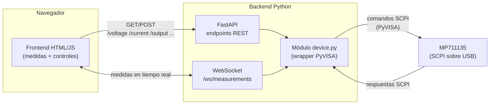

# MP711135 Tool

Interfaz web para controlar y monitorizar en remoto la fuente de alimentación DC **MP711135** (Multicomp Pro) desde el navegador, en vez de operarla desde sus controles físicos. El backend habla con el dispositivo por **USB usando comandos SCPI** a través de **PyVISA**, y expone esa funcionalidad a un frontend mediante una API construida con **FastAPI**.

## Qué hace la aplicación

- **Monitorización en tiempo real** de la salida: voltaje, corriente y potencia medidos, con gráfica de su evolución en el tiempo.
- **Control de la salida**: fijar tensión y límite de corriente, y encender/apagar la salida.
- **Configuración de protecciones**: ajustar los umbrales de OVP (sobretensión) y OCP (sobrecorriente).
- **Detección y aviso de fallos**: sobretensión, sobrecorriente o sobretemperatura, con indicación visual clara y opción de restablecer.
- **Indicación del modo de regulación** activo (CV - tensión constante / CC - corriente constante).
- **Modo multímetro** (si se documentan sus comandos SCPI, ver nota abajo): lectura de voltaje/corriente DC y AC, con función de congelar lectura (hold) y registro de máximo/mínimo.

En resumen: la app sustituye el panel físico del MP711135 por un panel web, pensado para poder ajustar y vigilar la fuente desde el PC mientras se trabaja en el banco.

## El dispositivo

El MP711135 es una fuente de alimentación DC de banco de un solo canal, con multímetro (DMM) integrado.

- **Salida:** 0-60V / 0-10A, 300W
- **Resolución:** 10mV / 1mA (ajuste y lectura)
- **Protecciones:** OVP 0-61V, OCP 0-10.1A, OTP 85°C
- **Comunicación:** USB, compatible con SCPI
- **Pantalla:** LCD color 2.8" (240×320)
- **DMM integrado:** voltaje/corriente AC y DC, resistencia, capacitancia, continuidad y test de diodo

> ⚠️ El manual de programación SCPI disponible solo documenta comandos de la **fuente de alimentación**, no del DMM. El modo multímetro de la interfaz depende de conseguir esa documentación adicional; hasta entonces queda fuera del alcance real de control.

### Comandos SCPI disponibles (fuente de alimentación)

**Medición**
- `MEASure:VOLTage?` / `MEASure:CURRent?` / `MEASure:POWer?`
- `MEASure:ALL?` — voltaje, corriente y potencia en una sola consulta
- `MEASure:ALL:INFO?` — además incluye estado de fallos (OVP/OCP/OTP) y modo de operación (standby/CV/CC/fault)

**Configuración de salida**
- `OUTPut {ON|OFF}` / `OUTPut?`
- `CURRent <value>` / `CURRent?`
- `CURRent:LIMit <value>` / `CURRent:LIMit?` (OCP)
- `VOLTage <value>` / `VOLTage?`
- `VOLTage:LIMit <value>` / `VOLTage:LIMit?` (OVP)

**Sistema**
- `SYSTem:LOCal` / `SYSTem:REMote`
- `*IDN?` / `*RST`

## Arquitectura

**Flujo:**
1. El frontend hace peticiones REST a FastAPI para ajustar voltaje, corriente, límites OVP/OCP y encender/apagar la salida.
2. Un WebSocket (`/ws/measurements`) empuja medidas (voltaje/corriente/potencia/estado) periódicamente para refrescar la UI en tiempo real sin polling constante.
3. Tanto los endpoints REST como el WebSocket pasan por el módulo `device.py`, que centraliza la conexión PyVISA y traduce llamadas Python a comandos SCPI.
4. `device.py` es el único punto que habla con el hardware por USB, evitando accesos concurrentes conflictivos al recurso VISA.

## Estado actual

- `frontend/MP711135.dc.html` — mockup funcional de la interfaz (fuente + multímetro), con **datos simulados**, no conectado todavía al dispositivo real ni a un backend. Sirve como referencia visual y de comportamiento para el desarrollo del backend.
- Backend (PyVISA + FastAPI): pendiente de empezar.
- Conexión real con el dispositivo por USB: pendiente de verificar.

## Stack

- **Backend:** Python, PyVISA, FastAPI
- **Comunicación con el dispositivo:** SCPI sobre USB
- **Frontend:** HTML/JS (por definir)
</content>
