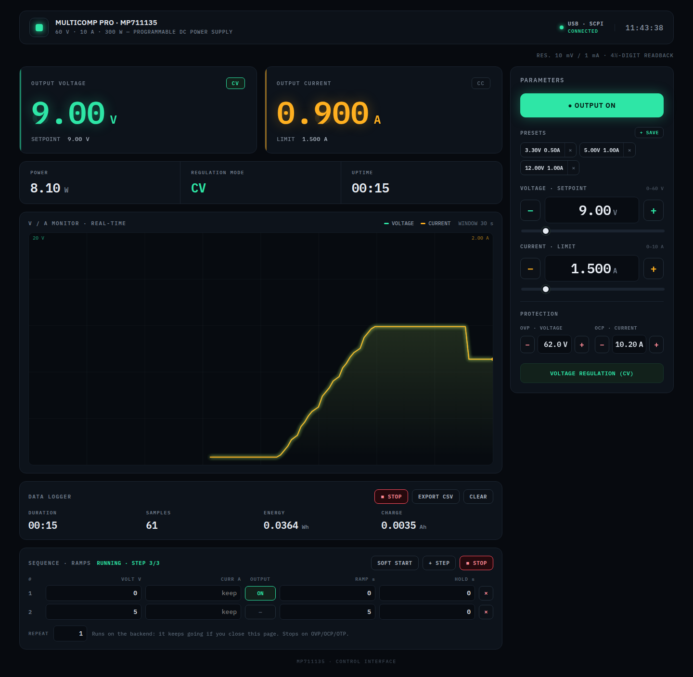
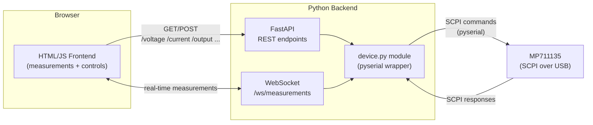

# MP711135 Tool



Web interface to remotely control and monitor the **MP711135** (Multicomp Pro) DC power supply from the browser, instead of operating it from its physical controls. The backend talks to the device over **USB using SCPI commands** through a serial port (**pyserial**), and exposes that functionality to a frontend via a **FastAPI**-built API.

## What the application does

- **Real-time monitoring** of the output: measured voltage, current and power, with a graph of their evolution over time.
- **Output control**: set voltage and current limit, and turn the output on/off.
- **Protection configuration**: adjust OVP (overvoltage) and OCP (overcurrent) thresholds.
- **Fault detection and warning**: overvoltage, overcurrent or overtemperature, with clear visual indication and a reset option.
- **Regulation mode indication**: shows the active mode (CV - constant voltage / CC - constant current).

In short: the app replaces the MP711135's physical panel with a web panel, designed to adjust and monitor the power supply from the PC while working at the bench.

## The device

The MP711135 is a single-channel bench DC power supply with a built-in multimeter (DMM).

- **Output:** 0-60V / 0-10A, 300W
- **Resolution:** 10mV / 1mA (setting and reading)
- **Protections:** OVP 0-61V, OCP 0-10.1A, OTP 85°C
- **Communication:** USB, SCPI-compatible
- **Display:** 2.8" color LCD (240×320)
- **Built-in DMM:** AC/DC voltage and current, resistance, capacitance, continuity and diode test

> ⚠️ The available SCPI programming manual only documents **power supply** commands, not the DMM's. The interface's multimeter mode depends on obtaining that additional documentation; until then it remains out of the actual scope of control.
>
> **Tested against real hardware:** assuming the DMM would respond to generic 34401A-style SCPI commands (`MEASure:VOLTage:DC?`, `MEASure:CURRent:DC?`, `MEASure:ALL?`, `FUNCtion?`, `CONFigure?`, plus AC/resistance/capacitance/continuity/diode), they were tested over the same serial port with the supply powered on at a known voltage (3.3V, no load). The DC commands returned no error, but their readings **exactly matched the power supply's own measurement** (not the DMM's physical probes), and the rest (AC, resistance, capacitance, continuity, diode) returned `ERR`. Conclusion: the firmware does not expose the built-in DMM over SCPI with this command set — it only redirects to the power supply's measurement channel. Without DMM-specific SCPI documentation, the multimeter mode is not remotely controllable; it likely only works from the physical panel.

### Available SCPI commands (power supply)

**Measurement**
- `MEASure:VOLTage?` / `MEASure:CURRent?` / `MEASure:POWer?`
- `MEASure:ALL?` — voltage, current and power in a single query
- `MEASure:ALL:INFO?` — also includes fault status (OVP/OCP/OTP) and operating mode (standby/CV/CC/fault)

**Output configuration**
- `OUTPut {ON|OFF}` / `OUTPut?`
- `CURRent <value>` / `CURRent?`
- `CURRent:LIMit <value>` / `CURRent:LIMit?` (OCP)
- `VOLTage <value>` / `VOLTage?`
- `VOLTage:LIMit <value>` / `VOLTage:LIMit?` (OVP)

**System**
- `SYSTem:LOCal` / `SYSTem:REMote`
- `*IDN?` / `*RST`

## Architecture



**Flow:**
1. The frontend makes REST requests to FastAPI to adjust voltage, current, OVP/OCP limits and turn the output on/off.
2. A WebSocket (`/ws/measurements`) pushes measurements (voltage/current/power/status) periodically to refresh the UI in real time without constant polling.
3. Both the REST endpoints and the WebSocket go through the `device.py` module, which centralizes the serial connection (pyserial) and translates Python calls into SCPI commands.
4. `device.py` is the only point that talks to the hardware over USB, avoiding conflicting concurrent access to the serial port.

## How to run the application

Designed to run on the Raspberry Pi (or another host) where the MP711135 is connected via USB; the browser controlling the power supply can be on any other machine on the same local network.

### Automatic installation (recommended): `install.sh`

With the MP711135 connected via USB:

```bash
./install.sh
```

Don't run it with `sudo`: it will only ask for a password for the specific steps that need it. The script:

1. Creates the venv and installs the backend dependencies.
2. Detects the connected USB-serial adapter (`idVendor`/`idProduct`) and installs a udev rule that gives it a stable path, `/dev/mp711135`, so it survives the device switching `/dev/ttyUSBx` on reconnection. If no adapter is connected when the script runs, it defaults to the CH340 chip ID (the one shipped with the MP711135) — connect it and re-run `install.sh`, or edit the rule by hand if your adapter is different.
3. Adds your user to the `dialout` group if needed.
4. Installs and starts two systemd services, `mp711135-backend` and `mp711135-frontend`, enabled to start automatically on every reboot.

It can be safely re-run (e.g. after a `git pull`): it reinstalls dependencies and restarts the services with the updated code.

Useful commands after installing:

```bash
systemctl status mp711135-backend mp711135-frontend   # status
journalctl -u mp711135-backend -f                      # live backend logs
sudo systemctl restart mp711135-backend                # restart after a manual change
```

### Manual installation (alternative, step by step)

#### 1. udev rule (once per host)

The USB-serial adapter (CH340) has no serial number, so Linux doesn't guarantee the same `/dev/ttyUSBx` after each reconnection (e.g. it may switch from `ttyUSB0` to `ttyUSB1`). For the backend to always find the device at the same path, you need to create a udev rule that generates a fixed `/dev/mp711135` symlink:

```bash
sudo tee /etc/udev/rules.d/99-mp711135.rules <<'EOF'
SUBSYSTEM=="tty", ATTRS{idVendor}=="1a86", ATTRS{idProduct}=="7523", SYMLINK+="mp711135"
EOF
sudo udevadm control --reload-rules
sudo udevadm trigger
```

Verify the symlink appears with the MP711135 connected: `ls -l /dev/mp711135` (it should point to a `ttyUSBx`). If the USB-serial adapter is different (not CH340), find its `idVendor`/`idProduct` with `lsusb` and adjust the rule.

#### 2. Backend (FastAPI + pyserial)

```bash
cd mp711135-tool
python3 -m venv .venv
.venv/bin/pip install -r backend/requirements.txt
.venv/bin/uvicorn backend.main:app --host 0.0.0.0 --port 8000
```

- The default serial port is `/dev/mp711135` (the stable symlink created above). The user running the command must belong to the `dialout` group to access it without `sudo`.
- It can be overridden with environment variables if needed: `MP711135_PORT`, `MP711135_BAUD`, `MP711135_TIMEOUT`, `MP711135_POLL_HZ` (see `backend/config.py`).
- If the USB gets disconnected, the interface's **USB · SCPI** indicator turns red (the backend detects the failure when reading/writing over the serial port and notifies it via WebSocket). The backend retries reopening `/dev/mp711135` on every polling cycle; when the cable is reconnected, it recovers on its own without restarting anything.
- `--host 0.0.0.0` is necessary so other machines on the LAN can reach the API; with `127.0.0.1` (uvicorn's default) it would only be accessible from the host itself.
- If the MP711135 is connected it switches it to remote mode on startup; you can verify with `curl http://localhost:8000/idn`. If it isn't connected (or is powered off) the backend still starts, shows **USB · SCPI** as disconnected, and keeps retrying until it appears.

#### 3. Frontend

`frontend/MP711135.dc.html` is a static file that must be served over HTTP (not opened with `file://`, because the runtime does `fetch()` against its own URL). From the same host as the backend:

```bash
cd frontend
python3 -m http.server 8080 --bind 0.0.0.0
```

And from the browser (on the Pi itself or another machine on the LAN): `http://<Pi-IP>:8080/MP711135.dc.html`.

The component has a `backendUrl` prop which is the API URL the frontend uses. By default it is empty, which means "the same host that served the page, port 8000" — so if the backend and frontend run on the same Pi, it just works whatever its IP is. Set it in the `data-props` of the `<script data-dc-script>` in `MP711135.dc.html` only if the backend runs on a different host or port.

React, Babel and the IBM Plex fonts are vendored in `frontend/vendor/`, so the interface loads on a LAN without internet access.

> **Tip:** the link you use from the browser (`http://<Pi-IP>:8080/...`) still depends on the Pi's IP. Since the Pi gets its IP via DHCP, reserve it in the router (fixed assignment by MAC) so a saved bookmark keeps working.

## Current status

- `frontend/MP711135.dc.html` — control interface connected to the real backend: `GET /state` on load, WebSocket `/ws/measurements` for live measurements, and `PUT`/`POST` to adjust setpoints, OVP/OCP limits and turn the output on/off. The simulated multimeter mode was removed (see the note about the DMM above).
- Backend (pyserial + FastAPI): implemented. Modules `device.py` (SCPI communication), `main.py` (REST endpoints + WebSocket) and `models.py` (Pydantic validation). Includes open CORS (`allow_origins=["*"]`) so the frontend, served from a different origin/port, can call the API.
- Real connection to the device over USB: **verified** against real hardware (`multicomp pro,MP711135,25281600,FV:V2.0.0` via `/dev/ttyUSB0`, CH340 adapter). Tested: `/idn`, `/state`, `/measurements`, `PUT /voltage` `/current` `/voltage-limit` `/current-limit` `/output`, `POST /faults/reset`, WebSocket `/ws/measurements` (5Hz stream) and range validation (422 for out-of-range values).
- Frontend integration with the real backend: **done and tested** on the LAN (backend on the Raspberry Pi, browser on another machine).

## Stack

- **Backend:** Python, pyserial, FastAPI
- **Device communication:** SCPI over USB (serial port)
- **Frontend:** HTML/JS, connected to the backend via REST + WebSocket

## License

This project is licensed under the [MIT License](LICENSE) — free to use, copy, modify and distribute, including for commercial purposes.
